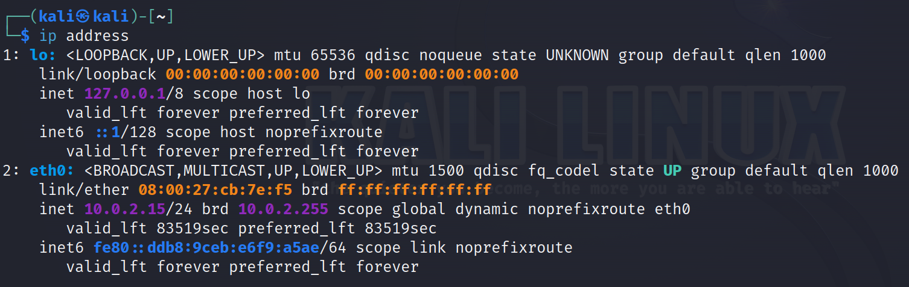
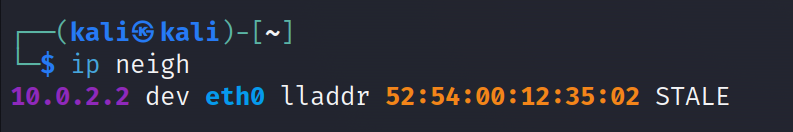
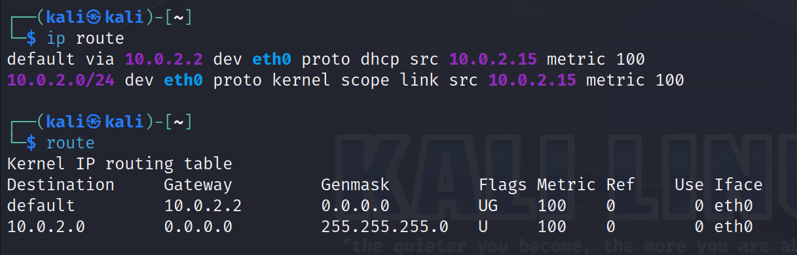
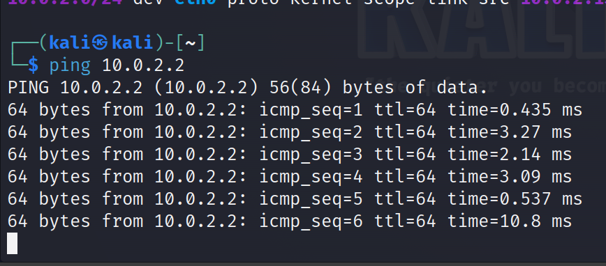
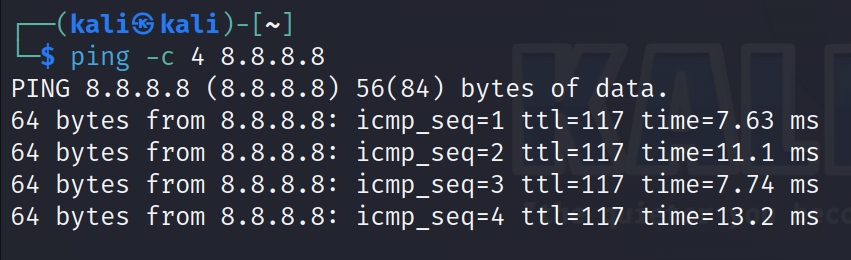
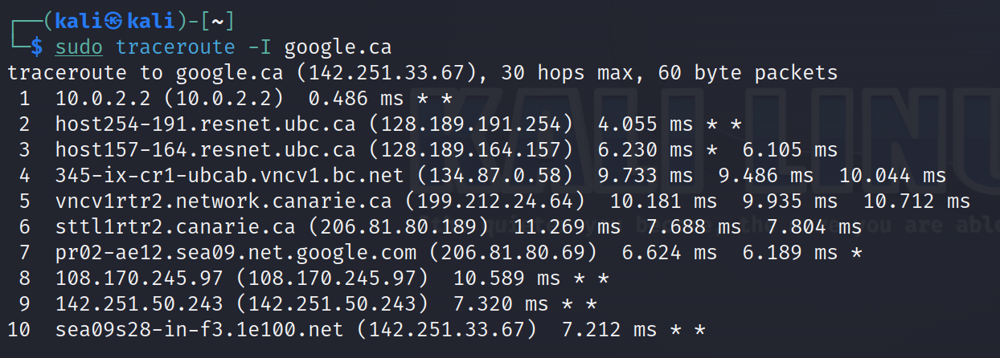

# Internet and Network Commands
 
The internet is a network of connected computers. In this section we will talk about basic internet and networking commands.

The goal of learning these commands is first and foremost to try and understand the internet better by looking at our own systems configuration.

## Commands

I provide basic information of each command shown.

Please take time to explore commands further.

You can see additional command options by using the help option (command name followed by -h). I will also try to attatch a link to documentation for each command.

If you are **not** the root user, use the sudo command before the following if you run in to any issues (i.e. if you run into issues running **command**, try **sudo command**).

### `ip`

A great resource for learning about the full functionality of this command is [written by Jeff Novotny](https://www.linode.com/docs/guides/how-to-use-the-linux-ip-command/). This sections has been adapted from his work. [Redhat](https://access.redhat.com/sites/default/files/attachments/rh_ip_command_cheatsheet_1214_jcs_print.pdf) also provides a great cheat sheet for comman commands.

<!-- If the link is broken, i downloaded the file -->

The `ip` command follows the format `ip [options] OBJECT COMMAND`. It is a command with mutliple functionalities that allow us to explore our computers network.

The `ip` command is the newer iteration of the established `ifconfig` command. `ip` also includes functionality from other commands including `route` and `arp`. Thus it has a broader scope and more features than the more limited ifconfig.

***

A useful first use of this command is `ip address`:

This command shows us the different network interfaces our computer is using. 

Here we have to network intefaces:

- `lo` stands for "loopback," which is a special network interface that a system uses to communicate with itself.
   - Don't worry too much of the output here for now. 

- `eth0` typically represents the first Ethernet network interface on the system. It's what connects the computer to a local network or the internet using an Ethernet cable or similar connection. The *IP address assigned to `eth0` is often the address through which the device communicates with other devices on the local network or the internet.*

We see some color coding in our output:
- Yellow is for MAC address.
   - The left address is your computers identifier, the right one is the broadcast (hence `brd`) MAC address.
      - broadcast addresses are addresses that represt **ALL** devices on a given network.
- Purple is for our IPv4 address. 
   - Here we also have an adjacent broadcast address.
   - The `/24` is a subnet mask. 
      - IPv4 addresses will be a set of 4 numbers, each ranging from 0 to 255 and sepearated by periods.
      - Each set of numbers is an 8 bit number. (255 is the largest 8 bit number)
      - `/24` means our network is represented by the first 24 bits -> the first three 8 bit numbers our our network.
      - In this case, when information is being sent to our computer, it gets sent to the first three digits `10.0.2` which is the network we are on. When it reachers our network (our router), the data will be sent to host `15` (our computer).  
- Blue is for IPv6 address.
   - As the internet grows, there is a need for more addresses. 
      - IPv4 is a 32 bit system (2^32possible address). 
      - IPv6 is a 128 bit system (2^128 possible addresses).
   - Because there are so many possible options for IPv6, the number is represented in hexadecimal (base 16) instead of decimal (base 10). 
   - The number will have eight groups of hexadeciaml numbers seprated by colons instead of 4 groups of decinal numbers separated by periods.
   - Our subnet this time is `/64` meaning the first 4 groups of the hexidecimal numbers represent our network, and the next 4 groups our host.

***
Another useful command is `ip neigh`:

`ip neigh` shows information about all other devices on your network. It is similar to a ARP table that maps IP addresses to MAC addresses of devices on a given network.

***

`ip route` is one more useful command. It is similar to the `route` command which may be easier to interperet for some:

The `ip route` command displays entries from the system's IP routing table, which contains routes to various network destinations. These entries tell the operating system how to forward IP packets to these destinations, which could be on the local network or remote networks. 

In other words, this command is useful because it may show us address we can talk to ther aren't on our network (dont share the same first 24 bits as our ip address).

### `ping`

The `ping` command allows us to check if a ip address is reachable. Recall from previous excercises my ip address was `10.0.2.15` and my gateway was `10.0.2.2`.

Lets check if I can communicate with my gateway:

You can see we are sending 1 packet of size 64 byte, and the amount of time it takes for a round trip each ping.

Note that when using the command as above, the computer will ping the ip you gave untill you tell it to stop. Stop the ping with <kbd>Ctrl</kbd>+<kbd>c</kbd>.

We can limit the amount of pings we send with the `-c [count]` option. Lets ping google (8.8.8.8) and try this:

Notice how the time for each ping is way larger than pinging my own gateway, this is because google servers are very far away from me!

This commnd is useful to check our connection to other devices, if we a ping fails there are a few reasons:
- Our computers outgoing connection is down.
- The address we are trying to reach is down or doesn't exist.
- The address we are trying to reach has a firewall that prevents it from recieving pings.

[Microsoft](https://learn.microsoft.com/en-us/windows-server/administration/windows-commands/ping) provides good documentation for this command and some more functionalities. Note, that we can also use domain names with this command and not just IP addresses.

### `traceroute`

Another fun command is `traceroute`. 

This command very simply can show us the different hops of a packets on its journey to a address. Notice that from the above example we started by visitng servers at UBC, went on to servers in Vancouvr (vncv), and finally reached servers in Seattle where the Google website is stored.

Note that the example was run on a virtual machine configured with a NAT adapter, if you were to run this command on a virtual machine with a bridge adapter or a regular computer you would not need the `-I` option.

