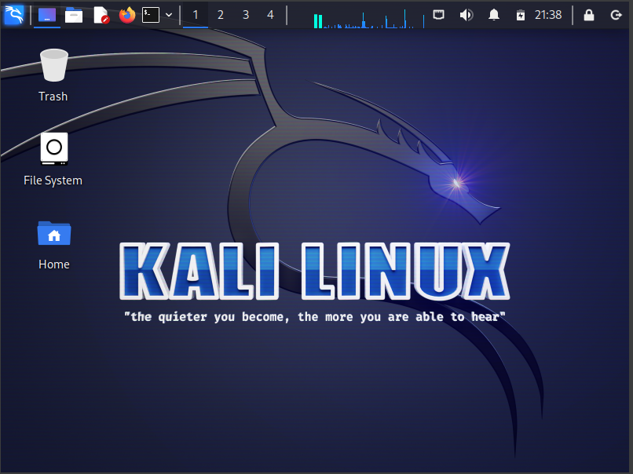

# Kali Linux 

*Note: the next few chapters will work with any version of Linux, this chapter quickly introduces Kali UI.**

## Overview
As with any operating you will see some familiar things on Kali. 

Your screen should look like this:

The top bar has useful icons you may need in the future, from left to right these are:
- Application finder
- Minimize all windows
- File explorer
- Notepad
- Firefox (web browser)
- Terminal
- Tabs 1, 2, 3, 4
- CPU usage stats
- Internet status
- Volume
- Notifications
- Battery status
- Time
- Lock screen
- Power button 

## Common Network Commands

## Viewing, Creating, and Editing Files

## Starting and Stopping Services

## Installing and Updating Tools

## Scripting with Bash