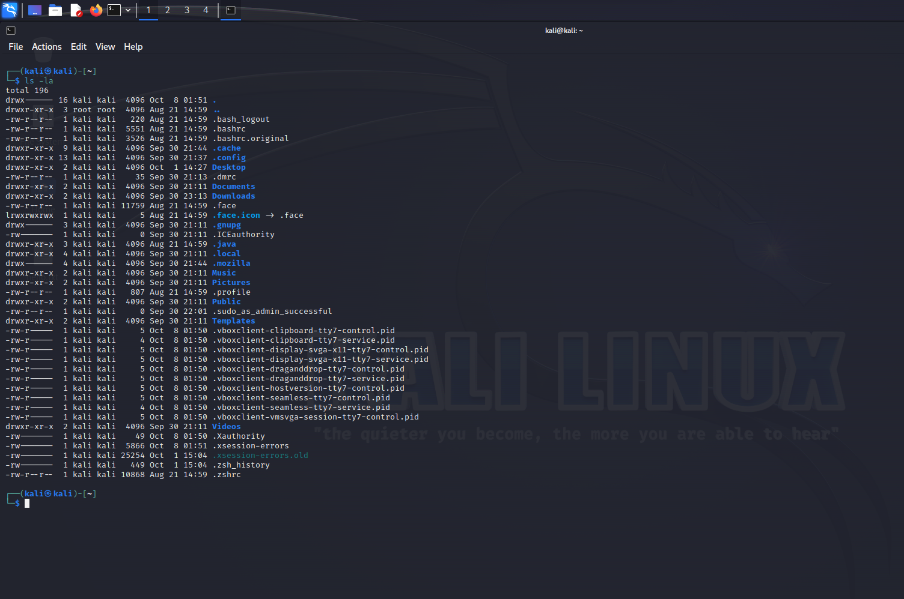
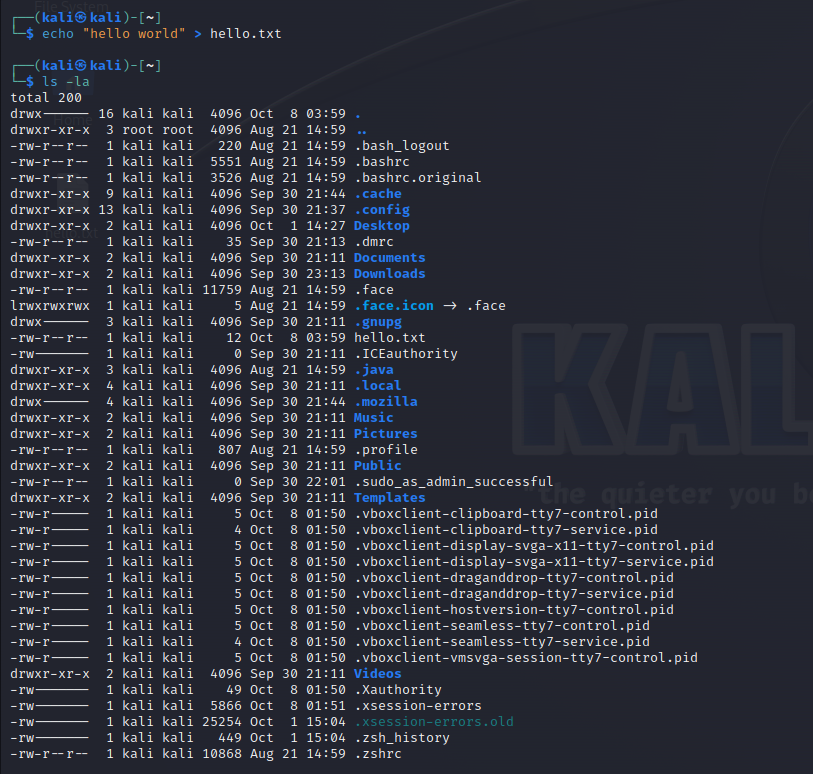
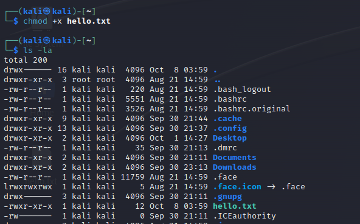
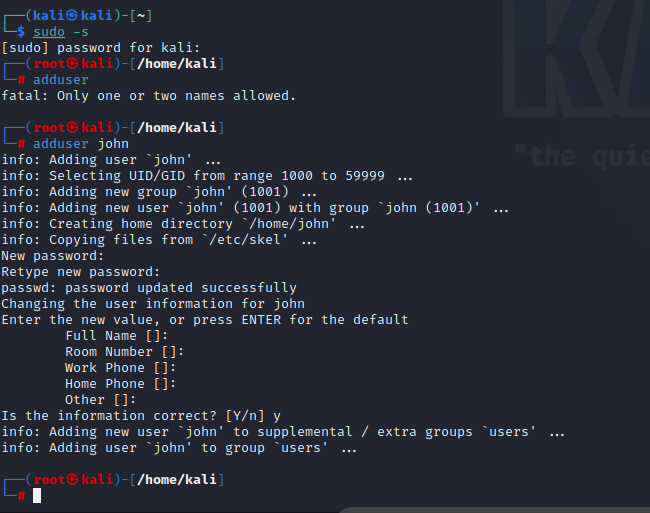
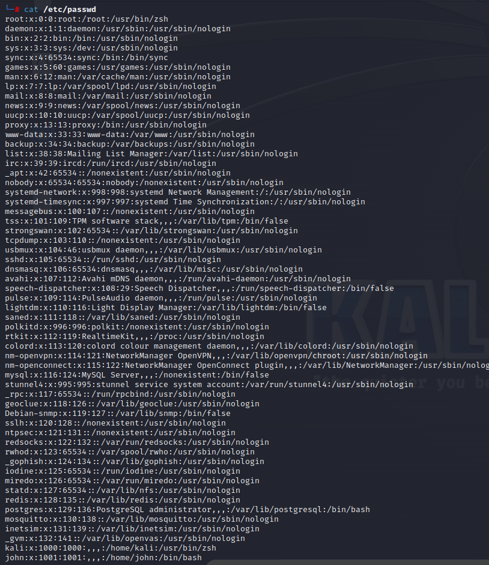
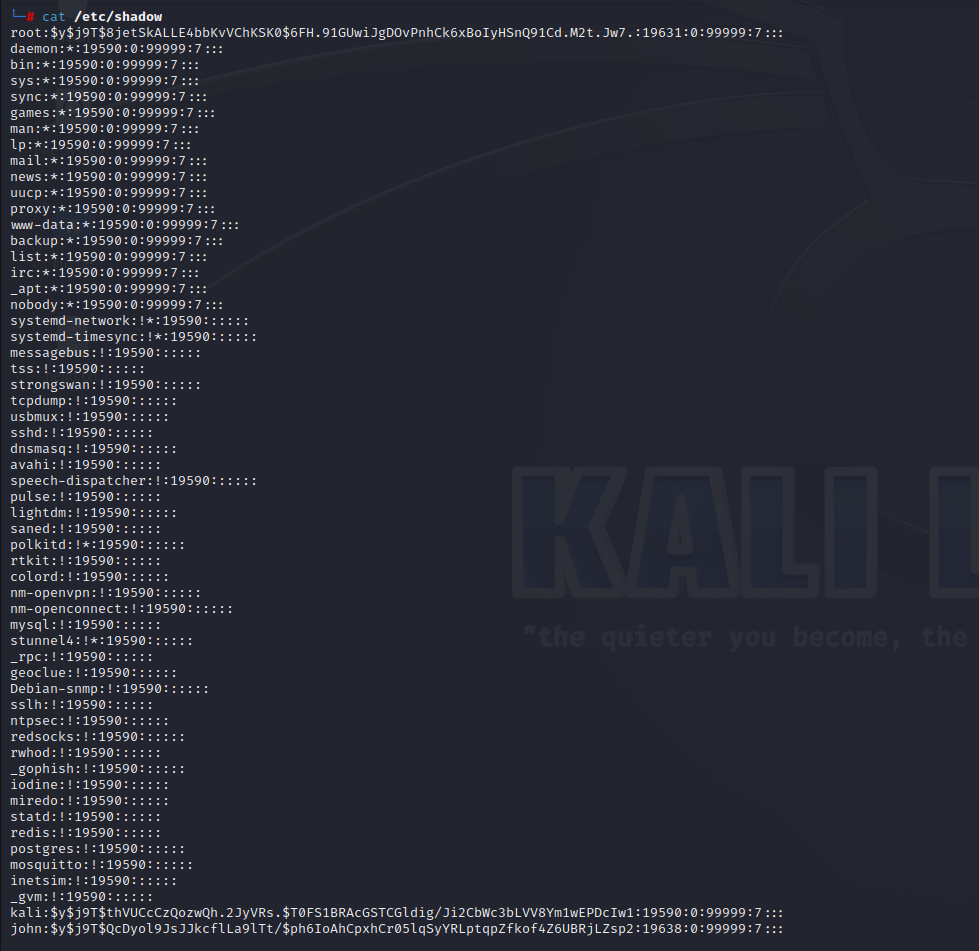
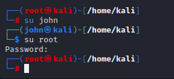
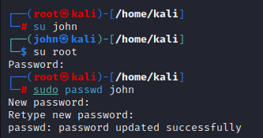
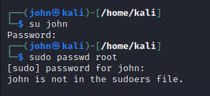

# Users and Priveleges

In this chapter we will talk about users and privalleges.

The new commands we will introduce are:

| Command | Use | Notes |
|---------|-----|-------|
|chmod|change permissions on a file or directory||
|adduser|add user to your OS ||
|su|switch user||
|sudo|allows you to elevate privellages||

We will also cover the following files:
- /etc/cpasswd
- /et/cshadow

## Read-Write access

Before we dive in to the new commands, lets go back to the <code>ls -la</code> command from the previous lesson.

If you run the command on your root, you should see something like this:

When looking at the left most column we see 10 letter strings with a combination of of charcters <code>d</code>,<code>r</code>,<code>w</code>,<code>x</code>, and <code>-</code>. These letter combinations actually have meaning and will tell us a lot about that line print.

If you take a deeper look you will notice that the first character is always either a "<code>d</code>" or a "<code>-</code>". These characters indicate the type of "thing" we are looking at:
- <code>d</code> is short for directory (folder).
- <code>-</code> indicates a file.

The next 9 characters are a mix of <code>r</code>,<code>w</code>,<code>x</code>, and <code>-</code>. Here they indicate, in sets of three ordered as <code>r</code>,<code>w</code>,<code>x</code> with <code>-</code> occasionaly replacing one of the letters, what type of access the following users have (from left to right):
- Owner of the file.
- A Group of owners of the file.
- All other users.

Where the letters indicate the following permissions:
- <code>r</code> is short for read privelages.
- <code>w</code> is short for write privelages.
- <code>x</code> is short for execute privelages.
- <code>-</code> is when there are no privelages.

This is important as it will allows us later on to identify vulnerable files which can be written and excuted without special privelages. 

## Changing access

How do you change access to a file?

Well first lets run the following command:

<code>echo "hello world" > hello.txt </code>

As you can see, when we do this the file does not have many privelages:

If we want to change the priveleges, you can use the <code>chmod</code> command. Here are two ways:
- add specific privellage with <code>chmode +c filename</code>, where c is the privelage you want to add.
- add all privelages to all users with <code>chmod 777</code>.

## Add user

Another thing you may want to learn how to do is add a user to your OS. We can do this with the <code>adduser</code> command:

Lets confirm John exists by printing out the content of <code>/etc/passwd</code>, a file that used to have all the passwords for a given system, but now only has previews of the users:

The file that stores actual passwords is <code>/etc/shadow</code>:

However, as you can see, it doesn't show the real password. It shows a hashcode the represents the passowrd - this can be reverse engineering to produce the real password.

## Switch user

We can switch between users with the <code>su</code> command:

You may notice that when we tried switching to root we are prompted for a password, however when we switch to john we were not. This is because john doesnt have "sudo" permission. A user who has "sudo" permissions will be in a sudoers file. Anybody in that file has full access to the computers file. We can see this difference if we try to change a users password from a different user:

